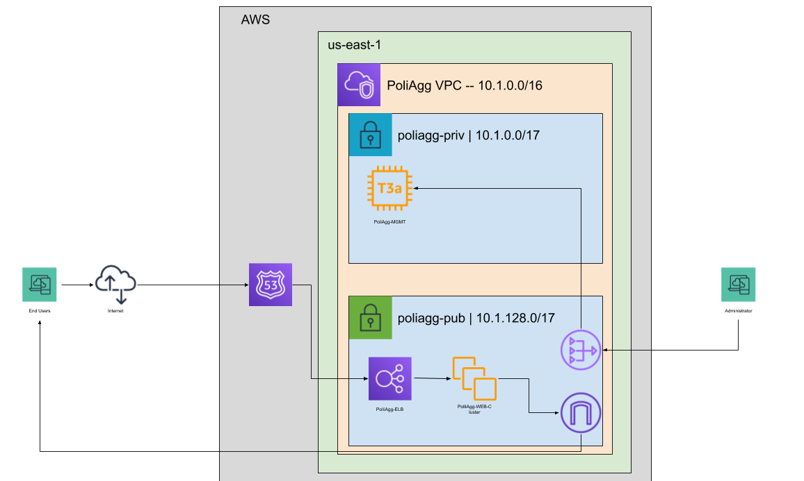

# PoliAgg
the goal is to create a website to aggregates information of all federal congressmen and congresswoman including their past positions in the federal 

## [Django](https://www.djangoproject.com/)
The main framework for the website run with Python3
* generated a MySQL database
* dynamic webpages using JavaScript and custom CSS
*  Separate modules for different services
* integrated twitter API
* integrated Django backend to interact with AWS services

## [AWS](https://aws.amazon.com/)
### Server Diagram

	Acquired AWS Cloud Practitioner Certification
### [EC2](https://aws.amazon.com/ec2/)
* Managed Configurations through userdata.sh shell script
* Briefly touched Autoscaling groups for PoliAgg webserver
* Strong grasp on differences between AWS Instance Types
### [S3](https://aws.amazon.com/s3/)
stores more static information concerning the website such as images and the code repository.
* used to host git repository for PoliAgg
* configured to save static information in PoliAgg
### [RDS](https://aws.amazon.com/rds/)
Holds all the tables concerning the people in congress and the data presented in the website with initial population using python web-scraper script 
* MySQL / Aurora
### [Lambda](https://aws.amazon.com/lambda/)
* Pulled down info from congress.gov and updated RDS instance
* Updated relevant info when certain item was called in Django by  
### [VPC](https://aws.amazon.com/vpc/)
* Secured private and public subnets in order for RDS and server to communicate without exposing RDS to public internet
* Generated route table to allow communication between subnets and internet
### [IAM](https://aws.amazon.com/iam/)
* Created IAM policies and roles to allow access from various AWS resources to other AWS resources
### [CodeDeploy / Code Pipeline (CI/CD Pipeline)](https://aws.amazon.com/codepipeline/)
* Automatically updates/creates web server when git repository is updated
## Scripts
* Bash script to download latest districts maps from government convert them into JSON files then separate the JSON into individual States for each of the districts
*  Python webscraper that handles dynamic calling of resources from both [congress.gov](https://www.congress.gov/) and [clerk.house.gov](https://clerk.house.gov/) compiled into zip files to run in AWS Lambda
