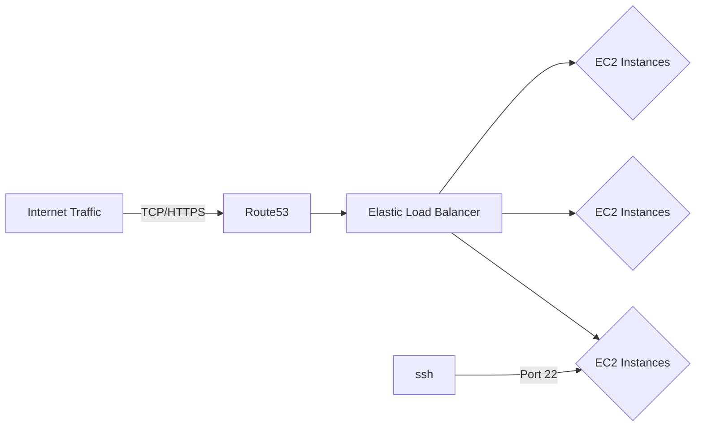

# PoliAgg
the goal is to create a website to aggregates information of all federal congressmen and congresswoman including their past positions in the federal 

## [Django](https://www.djangoproject.com/)
* generated a MySQL database
* dynamic webpages using JavaScript and custom CSS
*  Separate modules for different services
* integrated twitter API

## [AWS](https://aws.amazon.com/)
### Server Diagram

	Acquired AWS Cloud Practitioner Certification
### [EC2](https://aws.amazon.com/ec2/)
* Managed Configurations through userdata.sh shell script
* Briefly touched Autoscaling groups for PoliAgg webserver
* Strong grasp on differences between AWS Instance Types
### [S3](https://aws.amazon.com/s3/)
* used to host git repository for PoliAgg
* configured to save static information in PoliAgg
### [RDS](https://aws.amazon.com/rds/)
* MySQL / Aurora
### [Lambda](https://aws.amazon.com/lambda/)
* Pulled down info from congress.gov and updated RDS instance
* Updated relevant info when certain item was called in Django by  
### [VPC](https://aws.amazon.com/vpc/)
## Scripts
* Bash script to 

